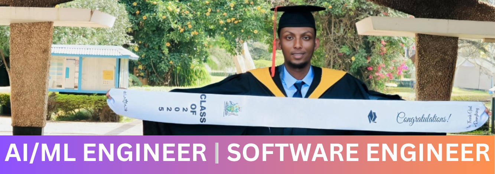

# Hi, I'm Abdiladif Hassan Adan 👋

  
  

I'm an **AI/ML and Software Engineer** with a **First Class Honours** degree in Computer Science specializing in building and deploying end-to-end intelligent applications. I bridge the gap between complex AI/ML systems and full-stack web development.

## 🛠️ My Tech Stack

### AI & Machine Learning

  
  
  
  
  
  
  
  

### Full Stack Development

  
  
  
  
  
  
  
 
  

### Cloud & DevOps

  
  
  
  
  
  
  

---

## 📊 My GitHub Stats

  
  

